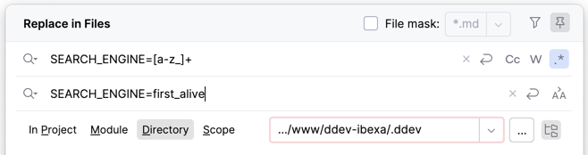

# Search

Made on Ibexa DXP Commerce 4.6.16 for Ibexa Summit 2025.
No promises but it should work on Ibexa DXP Headless 4.6.12, and upper editions and/or versions.

## Install

- Copy `src/Search/` to your installation.
- Merge `config/services.yaml` with yours.
  - Service definitions run from `# Index` to the bottom of the file.
  - Adapt the list of search engines passed to the wrapping search engine according to your installation and test purposes.
  ```
  parameters:
    app.search.engine.wrapper.list: ['elasticsearch', 'solr', 'legacy']
  ```
- Change the enabled search engine to `first_alive` or `less_capable`.
  It probably means to change the value of the environment variable `SEARCH_ENGINE`.
  For more information, 
  see https://doc.ibexa.co/en/latest/search/search_engines/elastic_search/install_elastic_search/
  or https://doc.ibexa.co/en/latest/search/search_engines/solr_search_engine/install_solr/
  - For DDEV using a web environment variable, it can only be to replace `SEARCH_ENGINE=[a-z_]+` pattern with,
    for example, `SEARCH_ENGINE=first_alive` in all `.ddev/` directory's files,
    then restart DDEV with `ddev restart`. After restart, you can check the new value with `ddev exec 'echo $SEARCH_ENGINE'`.
    
- Reindex with `ibexa:reindex` command.
- Optionally copy and modify `src/command/SearchCommand.php` to have an `app:search` command to run some tests.
